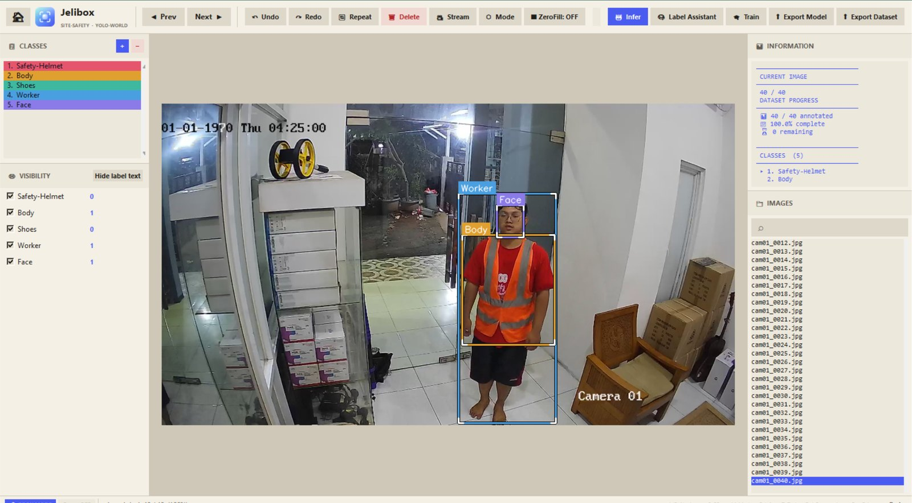
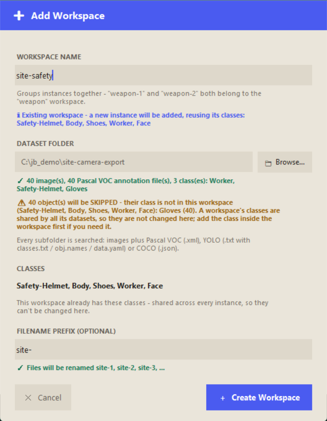
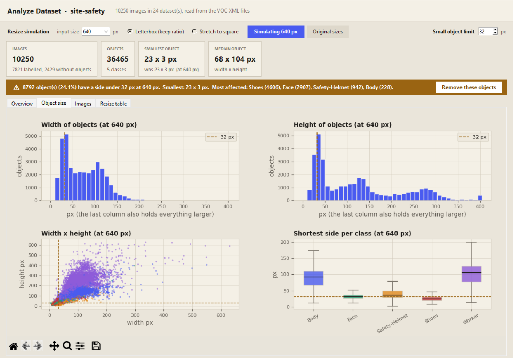
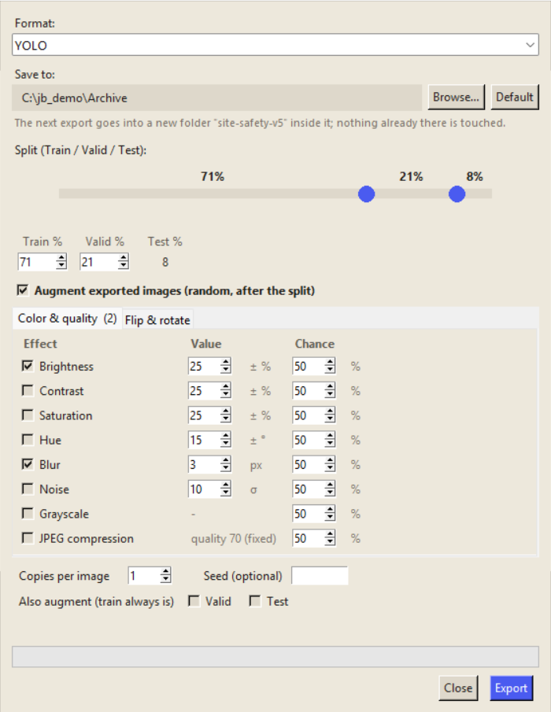
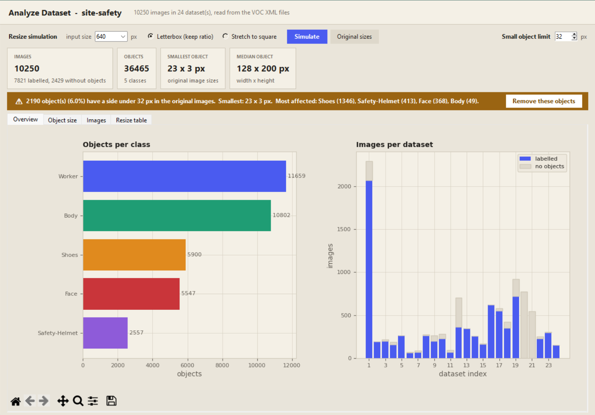

# Jelibox

**Soft to use. Sharp on every object.**

Jelibox is a private, local annotation tool for object detection and segmentation datasets. Import what you already have, label it with four kinds of AI help, see what it really contains in a built-in dashboard, and export it augmented, all on your own computer with no account and no upload.

[](LICENSE)
[](https://github.com/Jelibox/Jelibox-client/releases/latest)
[](jelibox_windows_installation.bat)
[](jelibox_linux_installation.bash)

[Website](https://jelibox.github.io/Jelibox-client/) | [Install in one line](#install-in-one-line) | [What's new](CHANGELOG.md)



## Install in one line

**Windows** - open **PowerShell** and paste:

```powershell
irm https://raw.githubusercontent.com/Jelibox/Jelibox-client/main/install.ps1 | iex
```

**Linux** - open a terminal and paste:

```bash
curl -fsSL https://raw.githubusercontent.com/Jelibox/Jelibox-client/main/install.sh | bash
```

It downloads the newest release and gives Jelibox its own private Python (via uv), so yours is never touched. Run the same command later to update; your datasets and models are never touched. Options, what it changes on your system, and the manual install are in [Installation](#installation).

## Why Jelibox

- **Private.** Images, labels and models stay on your machine. There is no account to create and nothing to upload.
- **Four auto-label modes.** Zero-shot prompts (YOLO-World), NVIDIA LocateAnything-3B, a small head you train for your own classes (Custom Model), or SAM 2 learning from your own labels with no training (SAM 2 Dynamic).
- **Any dataset in, any dataset out.** Import Pascal VOC, YOLO or COCO folders; export YOLO, Pascal VOC or COCO with augmentation, to any drive.
- **Understand it before you train.** A dashboard of class counts, object sizes and image resolutions, with a warning for objects that will be too small for your model, and a simulation of what resizing to 640 px (or any size) does to them.
- **Light on your computer.** The CPU is enough to start; an NVIDIA GPU makes the heavy modes fast. The window fits a 12-inch laptop screen.

## Highlights

### Four ways to auto-label

Pick a mode when Jelibox starts (and change it any time with the **Mode** button), then press **G** to label the current image, or choose **Full dataset** in the Infer window to label every image. [Modes](#modes) lists what each one needs.

| Mode | In one line |
| --- | --- |
| **YOLO-World** | Describe it in words, or use any Ultralytics model of your own. Nothing to download. |
| **LocateAnything** | NVIDIA LocateAnything-3B labels a whole folder from a list of categories. |
| **Custom Model** | A detector finds the objects, a small model you train gives each one your own class. |
| **SAM 2 Dynamic** | No training: SAM 2 learns from every image you annotate. |

### Bring any dataset in, safely

**Add Workspace** scans a folder and all its subfolders for images plus Pascal VOC, YOLO or COCO annotations (or images alone) and shows what it found before it copies anything. An optional filename prefix renames images and labels in order. If the annotations use a class your workspace does not have, you are warned first and those objects are skipped instead of being mixed in.



### Know your dataset before you train on it

Select a workspace and press **Analyze** for a dashboard of objects per class, size histograms, a width x height scatter and image resolutions. A warning strip appears when objects are smaller than a limit you set (32 px by default). **Simulate** shows what your smallest objects become when every image is resized to a model input size such as 640 px, by calculation only (no image is copied or resized), and a table compares 320 to 1280 so you can choose the input size that fits. **Remove these objects** deletes the tiny ones from the dataset after a warning to back it up first.



### Export augmented, and keep it where you want

**Export Dataset** writes YOLO, Pascal VOC or COCO with a train / valid / test split. Optional augmentation (brightness, contrast, saturation, hue, blur, noise, grayscale, JPEG compression, flips and rotation) moves boxes and polygons together with the picture, keeps your originals, and can be made repeatable with a seed. **Save to** lets you export to any folder, for example an HDD, so finished datasets stay off your SSD: each export becomes a new `<workspace>-v<N>` folder and nothing is ever overwritten.



## All features

- Local annotation workflow with no required cloud account
- A VS Code-style workspace picker for switching between datasets
- Bounding box annotation for object detection and polygon annotation for segmentation, with undo / redo (`Ctrl+Z` / `Ctrl+Y`)
- Four auto-label modes chosen on a front menu: **YOLO-World**, **LocateAnything**, **Custom Model** and **SAM 2 Dynamic** - see [Modes](#modes)
- AI-assisted annotation with the **Infer** button (or `G`): on the current image, or on **every image of the dataset at once**
- **Add Workspace** imports whole dataset folders (Pascal VOC, YOLO, COCO or images only) with an optional filename prefix
- **Analyze**: dataset dashboard, small-object warning with an adjustable limit, resize simulation, and removal of tiny objects
- **Export Dataset** to YOLO, Pascal VOC or COCO with optional augmentation and a **Save to** folder of your choice
- Model training from the annotation workspace, reading images straight from `datasetsInput/` (no duplicate copies)
- NVIDIA CUDA and CPU workflows, depending on the installed PyTorch build
- Class management, visibility toggles, image search, zoom, and multi-selection
- Repeat annotations from the previous image
- ZeroFill masking for removing sensitive image regions locally
- Light and dark themes
- Live camera or video inference through Streamlit

## Modes

When Jelibox starts it asks how it should annotate. The choice is remembered, shown in the **Mode** button of the workspace picker and in the annotation window's header, and changed any time with that button. In every mode, **Label Assistant** opens that mode's settings, **Infer** opens the *Infer window*, where you choose **Single image** (the default) or **Full dataset**, and `G` runs the label assistant with that choice. New annotations are always *merged* into what is already on an image: an existing annotation wins over an overlapping prediction, and running it twice never stacks duplicates. The full-dataset run has a Stop button, can skip images that are already labelled (default) and writes the Pascal VOC XML and the YOLO label of every image it annotates.

| Mode | What it does | What it needs |
| --- | --- | --- |
| **YOLO-World** | The original Jelibox. Zero-shot: describe what to look for ("white horse") and map each phrase to one of your classes, or use your own model: the one you trained in the workspace, or **any Ultralytics model** (e.g. a fine-tuned YOLOv8m) chosen with **Browse custom model**. | Nothing extra. Runs on CPU. |
| **LocateAnything** | [nvidia/LocateAnything-3B](https://huggingface.co/nvidia/LocateAnything-3B) through HF Transformers. List categories (English or Chinese), map them to your classes, and it labels the whole folder in one pass. Settings: decoding (`hybrid` best recall / `fast` / `slow`), device, image size, passes. | About 7.2 GB download on first use (Jelibox asks first), about 9 GB of free RAM and, on a GPU, 8 GB of VRAM. 64-bit Windows or x86-64 Linux. |
| **Custom Model** | Teach Jelibox your own labels. It finds the objects (people, bottles, ...), then a small model that you train gives every one of them **your** class: sleeping / working, or Coca-Cola / Fanta / Sprite. | Train it once with the **Train** button on images you already labeled (this makes `head_best.pt`), and the ultralytics version below. |
| **SAM 2 Dynamic** | No training. Annotate a few images and SAM 2 (through Ultralytics' `SAM2DynamicInteractivePredictor`) learns from every one of them, so it finds the same objects in the next image. | A SAM 2 model, downloaded once (75-224 MB). A GPU makes it fast; on a CPU it takes a few seconds per image. |

**Your own YOLO model (YOLO-World mode).** In Label Assistant choose *My trained model* and click **Browse custom model** to pick any Ultralytics `.pt` (detect or segment). Jelibox reads the model's class names and maps each one to a workspace class: same-name classes map by themselves, you choose the rest, and unmapped classes are skipped - so the model's class order does not have to match your workspace. The file stays where it is. Without Browse, the model you trained in the workspace (`models/<workspace>/modelAssistant.pt`) is used and its classes are matched by position in your class list, as before.

**LocateAnything details.** The model is downloaded to `models/_huggingface/` (inside the Jelibox folder; set `HF_HOME` to use your own cache), is loaded only when you first use it, and its code is pinned to a fixed, reviewed commit because loading it runs Python from its repository. The 3B model is never loaded at start-up and never in the other modes. Jelibox checks free memory before loading and refuses with a message instead of freezing the computer.

**Custom Model details.** Pick the checkpoint with **Browse head** in Label Assistant (put it in `models/<workspace>/` or browse to it). **Browse custom model** next to *Detector weights* chooses your own fine-tuned detector instead of the stock one; its class names then replace the COCO names in *Detect these classes*. A detector chosen this way must be the one the head was trained on (same architecture and layers), because the head reads its features. It carries its class names, the detector it was trained on (downloaded to `models/_detectors/` if missing), the neck layers it reads and the image size. Choose which detector classes to relabel (names or numbers: `person`, `bottle, cup`, `0, 39`) and map each head class to a workspace class (same-name classes map by themselves; unmapped ones are skipped). Needs `ultralytics>=8.4.68`. The checkpoint is read with `torch.load(weights_only=True)`, so a file that would run code is refused. The head training script it was ported from is in [`TOBEADDED/custom_dual_heads`](TOBEADDED/custom_dual_heads/README.md); its label format (`class cx cy w h`, one row per box) is exactly Jelibox's YOLO label format.

**Training your own model (Train button).** In this mode **Train** trains a head instead of a whole YOLO model. Label the boxes of the thing the detector finds (a person, a bottle) with your own classes (sleeping / working, Coca-Cola / Fanta), then press Train: choose the detector (a stock name such as `yolov8m.pt`, or **Browse custom model**), the image size, epochs and batch. The defaults are 384×640 (height × width, keeps a 16:9 picture's proportions, e.g. standing vs sitting), 50 epochs, batch 16, class weights on. The *taps* (the detector's neck layers the head reads) are filled in from the detector name: `15, 18, 21` for yolov8 / yolov9, `16, 19, 22` for yolo11 / yolo26 - check them for any other model. The last 20 % of the images (by file name) are held out to validate: the split is by position, not random, because video frames are near-duplicates and a random split would flatter the score. Training runs in its own process behind a progress window (loss, validation accuracy, macro-F1, time left, Stop). The detector is never changed (its weights are checked before and after). When it ends, the best head is saved as `models/<workspace>/head_best.pt` (an older one is kept as `head_best.prev.pt`) and selected in Label Assistant, so `G` and the full-dataset run use it right away. The run's job file, log (`train.log`) and last head live in `models/<workspace>/head_run/`. On a computer without an NVIDIA GPU it runs on the CPU, which takes minutes per epoch. The Label Assistant and Train windows scroll when they are taller than the screen (Save / Start stay visible).

**SAM 2 Dynamic details.** Draw the boxes (or polygons) on one or two images and move to the next image (`A` / `D`); every image you leave becomes a *reference*. Press **Infer** (or `G`) on a new image and SAM 2 finds the same classes there, as boxes or polygons depending on the **Mode** button. Each image is remembered **once**: it is one record keyed by the image, replaced whole whenever you leave it again, so going back and forth never counts an annotation twice. The newest references are used (6 by default, up to 20), annotations that the assistant made and you have not touched are not learned from, and a deleted image is forgotten. **Label Assistant** picks the model (`sam2.1_t` tiny ... `sam2.1_l` large, downloaded once into `models/_sam2/`), the image size, the number of references and the minimum score, and **Learn from my labeled images** loads the newest images you already labeled as references. References live in memory for the session. What SAM 2 is told follows the **Mode** button: in **polygon** mode it learns from your polygons and answers with polygons; in **box** mode it learns from your boxes (a polygon counts through its bounding box) and answers with boxes. A box is first turned into the object's silhouette by SAM 2 itself, so a box that also takes in a bit of background (a trouser hem around a boot) does not teach that background. For each class it is shown *every* object of that class in the reference image at once, because SAM 2 remembers whatever you did not mark as "not the object" - mark all the workers, not just one. SAM 2 keeps one object slot per class, so several objects of one class come back as pieces of one mask, and each separate piece becomes its own annotation. The **Train** button has nothing to train in this mode.

**One environment for all four modes.** [`requirements.txt`](requirements.txt) holds every package except PyTorch, with only the limits that matter: `ultralytics>=8.4.68`, `transformers==4.57.6` (must stay below 5) and `huggingface_hub>=0.34.0,<1.0` (the range transformers 4.57.6 accepts), plus `peft`, `lmdb` and `decord`, which the model's own code imports. PyTorch is not pinned: both the CUDA 12.1 build (torch 2.5.1) and the current CPU build were checked with these packages. No separate environment is needed.

## Requirements

### Linux

- Debian/Ubuntu/Mint, Fedora/RHEL/CentOS, or Arch/Manjaro
- Nothing to install first: Jelibox installs [uv](https://docs.astral.sh/uv/) if it is missing and uses it to download its own private Python 3.12 (with Tkinter) into its folder. Your own Python is never touched and nothing is put on your `PATH` for it
- `curl` or `wget` (to download uv) and internet access during installation
- System graphics libraries for OpenCV (`libgl1` + `libglib2.0-0` / `mesa-libGL` + `glib2` / `mesa` + `glib2`) - already present on normal desktops. **Only if they are missing, the installer asks for your `sudo` password to install them** (nothing else needs `sudo`)
- An NVIDIA driver and `nvidia-smi` for the CUDA PyTorch path

### Windows

- 64-bit Windows is recommended
- Nothing to install first: Jelibox installs [uv](https://docs.astral.sh/uv/) if it is missing and uses it to download its own private Python 3.12 into its folder. Your own Python is never touched, never registered with Windows and nothing is put on your `PATH` for it
- Microsoft Visual C++ Redistributable (included in [`VC_redist/`](VC_redist/)). **Only if it is missing, Windows asks for administrator permission** to install it - just that one installer is elevated, everything else runs as your normal user
- Internet access during installation

The application can run on CPU. NVIDIA GPU support requires a compatible NVIDIA driver and a PyTorch build with CUDA support.

## Installation

### Quick install (recommended)

One command, no `git` needed. It checks whether Jelibox is already installed in the default folder: if not, it installs the newest release fresh; if it is, it updates it automatically.

**Windows** - open **PowerShell** and paste:

```powershell
irm https://raw.githubusercontent.com/Jelibox/Jelibox-client/main/install.ps1 | iex
```

**Linux** - open a terminal and paste:

```bash
curl -fsSL https://raw.githubusercontent.com/Jelibox/Jelibox-client/main/install.sh | bash
```

What happens:

- The installer first asks where to install. Press **Enter** for the default - a `Jelibox` folder in your user folder, next to Downloads/Documents/Pictures (`%USERPROFILE%\Jelibox` on Windows, `~/jelibox` on Linux) - press **B** to pick a folder in a window (Linux needs `zenity` or `kdialog` for that), or type a path. A `Jelibox` folder is created inside the folder you choose. An existing install in the old default location (`%LOCALAPPDATA%\Jelibox` / `~/.local/share/jelibox`) is found and updated in place without asking.
- The normal installer then runs, in this order: it makes sure **uv** is installed (if not, it runs uv's official installer: `irm https://astral.sh/uv/install.ps1 | iex` on Windows, `curl -LsSf https://astral.sh/uv/install.sh | sh` on Linux), lets uv download Jelibox's **own private Python 3.12** into the install folder (`.python/`), creates the virtual environment (`venv/` on Windows, `jelibox/` on Linux) from it, installs the dependencies and adds shortcuts.
- **GPU question:** before downloading anything the installer asks whether this computer has a **discrete NVIDIA graphics card**. It suggests the answer it detected; press **Enter** to accept, or answer `Y` / `N`. *Yes* installs the CUDA build of PyTorch (about 2.5 GB, needs the NVIDIA driver); *No* installs the much smaller CPU-only build (no CUDA packages). AMD and Intel graphics cannot use CUDA, so answer *No* for them. To skip the question set `JELIBOX_GPU=nvidia` or `JELIBOX_GPU=cpu` first. Windows on ARM and Linux ARM are not asked (no CUDA build). To change your mind later, run the installer again (`JELIBOX_FORCE=1` if it says you are up to date) and answer differently.
- **What touches your system:** only uv, installed for your user (`~/.local/bin` or `%USERPROFILE%\.local\bin`; uv's installer adds that folder to your `PATH`, and only that folder - it is not Python). Jelibox's Python is never installed system-wide, never added to `PATH`, never registered with Windows (`py -3.12` does not see it) and is only used by Jelibox, which runs it by its full path. The Python you already use is left alone.
- **Administrator rights:** Windows needs none, except to install the Visual C++ runtime when it is missing (just that installer asks for permission). Linux needs no `sudo`, except to install the OpenCV system libraries (`libGL`, GLib) when they are missing.
- **No uv access?** If the installer cannot download uv, install it yourself from <https://docs.astral.sh/uv/> (or set `JELIBOX_UV` to an existing `uv` executable) and run the installer again.
- **Updating:** run the same command again. It reports what it found (`Found Jelibox v0.1.0 ... updating to v0.2.0`), updates in place, and never touches your datasets, models or configs. If you are already on the newest version it says so and stops (`JELIBOX_FORCE=1` reinstalls anyway). A folder that is a `git` checkout is left alone - use `git pull` there.
- **Find the install folder:** click **Open Folder** in the workspace picker toolbar (next to Add Workspace).
- **Move it somewhere else:** click **Move Jelibox** in the workspace picker and choose a folder. Jelibox creates `<folder>/Jelibox`, builds a fresh virtual environment there (same package versions, needs internet), moves your datasets, models and configs over, and deletes the old venv and folder. If anything fails before the files are moved, the old install is left untouched.
- **A specific version:** set `JELIBOX_VERSION` first, for example `$env:JELIBOX_VERSION="v0.1.0"` (PowerShell) or `JELIBOX_VERSION=v0.1.0 curl ... | bash`. Use `main` for the latest development version (changes not in a release yet). Other options: `JELIBOX_GPU` (`nvidia` or `cpu`, skips the GPU question), `JELIBOX_HOME` (install location), `JELIBOX_NO_INSTALL=1` (download and unpack only) and `JELIBOX_FORCE=1` (reinstall even if current). If `uv` is already on your machine it is reused.
- **Want to read it before running it?** That is a good habit. The scripts are short: [`install.ps1`](install.ps1) and [`install.sh`](install.sh).
- **Uninstall:** delete the install folder above, plus the Jelibox shortcuts (Desktop / application menu). The private Python lives inside that folder. The only thing left is uv, which you can keep for your own projects or remove as described at <https://docs.astral.sh/uv/>.

### Manual install (with git)

The steps below do the same thing by hand.

#### Linux

1. Install git (if you haven't install git)
```bash
sudo apt install git
```
2. Clone this repository
```bash
git clone https://github.com/Jelibox/Jelibox-client.git 
```
3. Add access to linux installation script
```bash
chmod +x jelibox_linux_installation.bash
```
4. Run Jelibox installation script
```bash
./jelibox_linux_installation.bash
```

The installer needs no `sudo` unless the OpenCV system libraries are missing (it then asks for your password at that step). It installs uv if needed, downloads Jelibox's private Python into `.python/`, creates the `jelibox/` virtual environment, installs dependencies, and creates a desktop launcher.

#### Windows

1. Double-click [`jelibox_windows_installation.bat`](jelibox_windows_installation.bat). Do not run it as administrator: it asks Windows for permission itself, only to install the Visual C++ runtime, and only when it is missing.
2. Follow the installer prompts.
3. Open the generated `Jelibox.lnk` shortcut.

The Windows installer detects an NVIDIA GPU through `nvidia-smi` (with Windows device information as a fallback) only to suggest an answer; it then asks you whether this computer has a discrete NVIDIA GPU and installs the matching PyTorch build. GPU detection does not guarantee that the installed PyTorch package has CUDA enabled. The Linux installer asks the same question.

## Running Jelibox Manually

### Linux

```bash
jelibox/bin/python -u utils/Annotator.py
```

### Windows

```bat
venv\Scripts\python utils\Annotator.py
```

Use the environment's `python` by its path as shown (the shortcuts do the same) instead of activating it, so your own Python stays the one on `PATH`. The `python` commands in the troubleshooting section below mean this interpreter.

Running `Annotator.py` with no arguments opens the **workspace picker** - a VS
Code-style "no folder opened" screen that lists every workspace found in
`datasetsInput/`. Folders are grouped by name, so `weapon-1` and `weapon-2`
both appear under one `weapon` workspace; picking an instance launches the
annotation window for it. Inside the annotation window, the **◀** button next
to the Jelibox logo closes that workspace and returns to the picker so you can
switch datasets without restarting the app.

## Keyboard Shortcuts

| Key | Action |
| --- | --- |
| `A` / `Left Arrow` | Previous image |
| `D` / `Right Arrow` | Next image |
| `Delete` | Delete the current image |
| `M` | Toggle bounding box and polygon mode |
| `B` | Force a new bounding box |
| `G` | Run the Label Assistant (Infer): on the current image or on the whole dataset, as chosen in the Infer window |
| `T` | Open the training workflow |
| `S` | Change the selected annotation class |
| `R` | Delete the selected annotation |
| `E` | Repeat annotations from the previous image |
| `Esc` | Cancel the current operation or exit |

In polygon mode, click to add points, double-click or press `Enter` to finish, and right-click a point to delete it.

## Workspace Structure

Jelibox keeps data, annotations, and models separated by workspace. Images are
never copied - every format reads them straight from `datasetsInput/`:

```text
datasetsInput/<workspace>-<index>/   Input images for annotation (read-only source)
vocdataset/<workspace>/              Pascal VOC XML annotations
YOLOdataset/<workspace>/labels/      YOLO .txt labels (keyed by image filename)
models/<workspace>/                  Trained YOLO models (and your head checkpoints)
models/<workspace>/head_run/         Head training job, log and last head
models/_huggingface/                 LocateAnything-3B download (shared by all workspaces)
models/_detectors/                   Detector weights fetched for the Custom Model mode
configs/<workspace>.json             Workspace classes and Label Assistant settings for every mode
export dataset/<workspace>/          Exported datasets
export model/<workspace>/            Exported model files
```

`YOLOdataset/<workspace>/` also doubles as scratch space during training: a
`train/`, `val/`, and `data.yaml` are generated there temporarily and removed
once training finishes.

Every time a workspace is opened, Jelibox checks each Pascal VOC XML file in
`vocdataset/<workspace>/` for a matching YOLO label and generates any that are
missing. This keeps `YOLOdataset/` in sync automatically - including a
one-time backfill for datasets annotated before this folder existed - without
requiring you to re-save every image. Already-synced workspaces open
instantly; only the first sync of a large, previously-unsynced dataset takes
noticeably longer, and a progress screen is shown while it runs.

Example workspace:

```text
datasetsInput/cat-2/
vocdataset/cat/
YOLOdataset/cat/
models/cat/
configs/cat.json
```

## Annotation Formats

Jelibox supports:

- Bounding boxes for YOLO object detection datasets
- Polygons for segmentation workflows
- Pascal VOC XML annotations in the `vocdataset/` workspace folder
- YOLO labels in the `YOLOdataset/<workspace>/labels/` folder, paired with images from `datasetsInput/` at training/export time
- COCO JSON YOLO exports with bounding boxes and polygon segmentations
- Importing Pascal VOC, YOLO and COCO datasets (any folder layout) through **Add Workspace**

## Exporting a Dataset

Use the **Export Dataset** action in the application to export YOLO, Pascal VOC, or COCO data with train, validation, and test splits.

**Save to:** by default the dataset goes into `export dataset/<workspace>/` inside Jelibox (the previous export of that workspace is replaced). Press **Browse...** to save anywhere else instead - an HDD or an external drive, for example, to keep finished datasets (images and annotations together) off the SSD. Jelibox then makes a new folder `<workspace>-v<N>` inside the folder you chose: N is one more than the highest `<workspace>-v<number>` already there (`ppe-v1`, then `ppe-v2`, ... and if `ppe-v4` exists the next one is `ppe-v5`), so an archive is never overwritten and nothing in your folder is deleted. The folder is remembered for next time; **Default** switches back. If the remembered folder is not there any more (an unplugged external drive, say) the default folder is used instead and the window says so; the choice is kept and used again once the drive is back. Before exporting, Jelibox checks that the folder can be written to and that the images alone fit in its free space.

COCO exports use this structure:

```text
<workspace>/
├── images/
│   ├── train/
│   ├── val/
│   └── test/
└── annotations/
	├── instances_train.json
	├── instances_val.json
	└── instances_test.json
```

The COCO exporter reads images from all indexed folders matching `datasetsInput/<workspace>-<index>/` and annotations from `vocdataset/<workspace>/`. The YOLO exporter does the same for images, pairing each one with its label in `YOLOdataset/<workspace>/labels/`.

The standalone YOLOX conversion utility can be run with:

```bash
python exportTools/export2YOLOX.py
```

## GPU and PyTorch Troubleshooting

Check the NVIDIA driver first:

```bash
nvidia-smi
```

Then check whether the active Python environment can use CUDA:

```bash
python -c "import torch; print(torch.__version__); print(torch.cuda.is_available()); print(torch.version.cuda)"
```

`nvidia-smi` detecting a GPU does not mean that PyTorch has CUDA enabled. The driver, PyTorch build, CUDA runtime, and GPU architecture must be compatible.

For training failures caused by limited memory, try a smaller image size, a smaller batch size, a smaller model, or a smaller dataset split.

## Screenshots




## Contributing

Issues, documentation improvements, bug fixes, and feature contributions are welcome.

```bash
git clone https://github.com/Jelibox/Jelibox-client.git
cd Jelibox-client
git checkout -b feature/your-feature-name
```

Before opening a pull request, test the installer or application flow affected by your change and describe the platform used.

## Testing

One command checks everything (no data of yours is touched - tests run in a temp workspace):

```bash
python tests/run.py            # repo hygiene + unit + integration + GUI
python tests/run.py --fast     # skip the GUI group (works without a display)
python tests/run.py --only unit,repo
python tests/run.py -k assistant -v
```

Run it with the project's virtual environment (`venv\Scripts\python` on Windows, `jelibox/bin/python` on Linux). It uses only the standard `unittest` module, so there is nothing extra to install.

## License

Jelibox is released under the [Apache License 2.0](LICENSE).
